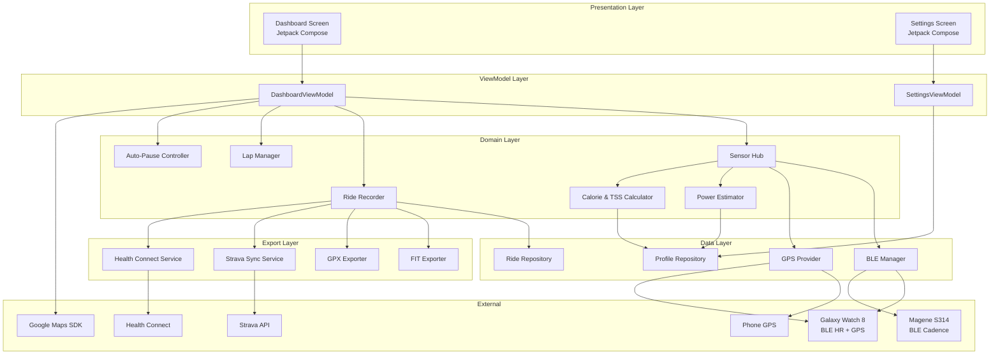
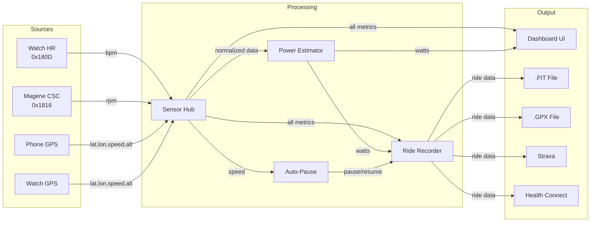

# Design Document: CycleComp

## Overview

CycleComp is a native Android cycling computer application built with Kotlin and Jetpack Compose. It transforms a Samsung S24 phone into a full-featured bike computer by connecting to BLE sensors (Samsung Galaxy Watch 8 for heart rate + secondary GPS, Magene S314 for cadence), estimating power via a physics model, recording rides, and exporting data to .FIT/.GPX files, Strava, and Health Connect.

The app follows a single-activity architecture with a primary dashboard screen showing all metrics in a tile-based layout. A secondary settings screen handles rider profile configuration. The system is organized around a reactive data pipeline: BLE sensors and GPS feed raw data into a Sensor Hub, which normalizes and distributes it to the dashboard UI, the power estimator, and the ride recorder.

### Key Design Decisions

| Decision | Choice | Rationale |
|---|---|---|
| UI Framework | Jetpack Compose | Modern declarative UI, first-class Kotlin support, efficient recomposition for real-time data |
| BLE Communication | Android BLE API directly | Standard BLE HR Service (0x180D) and CSC Service (0x1816) avoid SDK lock-in |
| GPS Source | Phone GPS primary, Watch GPS fallback | Phone GPS is more accurate; watch GPS provides redundancy |
| Power Estimation | Physics-based model | No physical power meter; uses speed, gradient, weight, aero coefficients |
| Map Provider | Google Maps SDK for Android | Industry standard, turn-by-turn support, kill switch for battery savings |
| File Export | .FIT (Garmin FIT SDK) + .GPX (XML) | Universal compatibility with cycling platforms |
| Data Sync | Strava OAuth 2.0 + Health Connect API | Direct Strava upload; Health Connect bridges Samsung Health and other apps |
| Architecture | MVVM + Repository pattern | Clean separation of concerns, testable, Compose-friendly |
| DI Framework | Hilt | Standard for Android, lifecycle-aware, minimal boilerplate |
| Local Storage | Room + DataStore | Room for ride history, DataStore for preferences |

## Architecture

### High-Level Architecture



### Data Flow




### Reactive Pipeline

All sensor data flows through Kotlin `StateFlow` / `SharedFlow` streams:

1. **BLE Manager** emits raw BLE characteristic values as `SharedFlow<ByteArray>`
2. **GPS Provider** emits `StateFlow<GpsReading>` from `FusedLocationProviderClient`, with fallback logic to watch GPS
3. **Sensor Hub** combines all flows into a unified `StateFlow<SensorSnapshot>` using `combine()`
4. **Dashboard ViewModel** collects `SensorSnapshot` and maps it to UI state
5. **Ride Recorder** collects `SensorSnapshot` and appends to the ride timeline

This ensures the UI always reflects the latest sensor state, and the recorder captures every data point.

## Components and Interfaces

### 1. BLE Manager (`BleManager`)

Responsible for scanning, connecting, and maintaining BLE connections to heart rate and cadence sensors.

```kotlin
interface BleManager {
    val discoveredDevices: StateFlow<List<BleDevice>>
    val connectionStates: StateFlow<Map<String, ConnectionState>>

    suspend fun startScan(serviceUuids: List<UUID>, timeoutMs: Long = 10_000)
    suspend fun stopScan()
    suspend fun connect(deviceAddress: String): Result<Unit>
    suspend fun disconnect(deviceAddress: String)
    fun getCharacteristicFlow(deviceAddress: String, characteristicUuid: UUID): Flow<ByteArray>
}

data class BleDevice(
    val address: String,
    val name: String?,
    val serviceUuids: List<UUID>,
    val rssi: Int
)

enum class ConnectionState {
    DISCONNECTED, CONNECTING, CONNECTED, RECONNECTING
}
```

**Reconnection logic**: On disconnect during a ride, the manager enters `RECONNECTING` state and attempts reconnection every 5 seconds for up to 60 seconds. After 60 seconds, it transitions to `DISCONNECTED` and emits a notification event.

**Auto-connect on launch**: On app start, the manager reads previously paired device addresses from DataStore and attempts connection.

### 2. Sensor Hub (`SensorHub`)

Aggregates data from all sensor sources and resolves fallback logic.

```kotlin
interface SensorHub {
    val sensorSnapshot: StateFlow<SensorSnapshot>
    val heartRateZone: StateFlow<HeartRateZone?>

    fun start()
    fun stop()
}

data class SensorSnapshot(
    val heartRateBpm: Int?,           // null = no signal
    val cadenceRpm: Int?,             // null = no signal
    val speedKmh: Double?,            // null = no GPS
    val locationLat: Double?,
    val locationLon: Double?,
    val altitudeM: Double?,
    val gradientPercent: Double?,
    val gpsSource: GpsSource,
    val timestamp: Long
)

enum class GpsSource { PHONE, WATCH, NONE }

enum class HeartRateZone(val range: IntRange) {
    ZONE1(0..119),
    ZONE2(120..139),
    ZONE3(140..159),
    ZONE4(160..179),
    ZONE5(180..220)
}
```

**GPS Fallback**: The hub monitors phone GPS availability. If phone GPS is unavailable for >5 seconds and watch GPS is available, it switches `gpsSource` to `WATCH`. When phone GPS resumes, it switches back.

### 3. GPS Provider (`GpsProvider`)

```kotlin
interface GpsProvider {
    val location: StateFlow<GpsReading?>
    val cumulativeDistanceKm: StateFlow<Double>
    val cumulativeElevationGainM: StateFlow<Double>
    val currentGradientPercent: StateFlow<Double>

    fun start()
    fun stop()
    fun reset()
}

data class GpsReading(
    val latitude: Double,
    val longitude: Double,
    val altitudeM: Double,
    val speedMps: Double,
    val accuracyM: Float,
    val source: GpsSource,
    val timestamp: Long
)
```

**Speed calculation**: Primary speed comes from `Location.speed` (GPS Doppler). Distance is accumulated via Haversine between consecutive GPS points. Gradient is calculated as `(altitudeChange / horizontalDistance) * 100` over a 50m rolling window to smooth noise.

### 4. Power Estimator (`PowerEstimator`)

```kotlin
interface PowerEstimator {
    val currentPowerW: StateFlow<Double>
    val averagePowerW: StateFlow<Double>
    val normalizedPowerW: StateFlow<Double>

    fun update(speedMps: Double, gradientPercent: Double, headwindMps: Double = 0.0)
    fun reset()
}
```

**Power model** (simplified cycling power equation):

```
P_total = P_gravity + P_rolling + P_aero + P_accel

P_gravity = m_total * g * sin(arctan(gradient/100)) * v
P_rolling = Crr * m_total * g * cos(arctan(gradient/100)) * v
P_aero = 0.5 * CdA * rho * (v + v_wind)^2 * v
P_accel = m_total * a * v
```

Where:
- `m_total` = rider weight + bike weight (from profile, defaults: 75kg + 9kg)
- `g` = 9.8067 m/s²
- `Crr` = 0.005 (rolling resistance coefficient, road tires)
- `CdA` = 0.4 m² (drag area, hoods position)
- `rho` = 1.225 kg/m³ (air density at sea level)
- `v` = speed in m/s
- `a` = acceleration in m/s² (derived from speed delta)

**Normalized Power**: 30-second rolling average of power, raised to the 4th power, averaged, then 4th root. Used for TSS calculation.

### 5. Ride Recorder (`RideRecorder`)

```kotlin
interface RideRecorder {
    val rideState: StateFlow<RideState>
    val elapsedTime: StateFlow<Duration>
    val currentRide: StateFlow<RideData?>

    fun start()
    fun pause()
    fun resume()
    fun stop(): RideData
    fun addLap()
}

enum class RideState { IDLE, RECORDING, PAUSED, STOPPED }
```

**Time tracking**: Uses `SystemClock.elapsedRealtime()` for monotonic timing. Elapsed time excludes paused periods (both manual and auto-pause).

### 6. Auto-Pause Controller (`AutoPauseController`)

```kotlin
interface AutoPauseController {
    val isAutoPaused: StateFlow<Boolean>

    fun onSpeedUpdate(speedKmh: Double)
}
```

**Logic**: When speed drops below 2 km/h, a 3-second timer starts. If speed remains below threshold for the full 3 seconds, auto-pause triggers. When speed exceeds 2 km/h, auto-pause is immediately released.

### 7. Lap Manager (`LapManager`)

```kotlin
interface LapManager {
    val currentLap: StateFlow<LapData>
    val completedLaps: StateFlow<List<LapData>>

    fun markLap()
    fun reset()
}

data class LapData(
    val lapNumber: Int,
    val startTime: Long,
    val endTime: Long?,
    val distanceKm: Double,
    val averagePowerW: Double,
    val elapsedTime: Duration
)
```

### 8. Calorie & TSS Calculator (`CalorieAndTssCalculator`)

```kotlin
interface CalorieAndTssCalculator {
    val caloriesBurned: StateFlow<Double>
    val tss: StateFlow<Double>

    fun update(heartRateBpm: Int?, normalizedPowerW: Double, durationSec: Double)
    fun reset()
}
```

**Calorie formula** (heart-rate based, Keytel et al.):
```
Male: kcal/min = (-55.0969 + 0.6309*HR + 0.1988*weight + 0.2017*age) / 4.184
```

**TSS formula**:
```
TSS = (duration_sec * NP * IF) / (FTP * 3600) * 100
IF = NP / FTP
```
Default FTP = 200W if not configured.

### 9. File Exporter (`FileExporter`)

```kotlin
interface FitExporter {
    fun serialize(ride: RideData): ByteArray
    fun deserialize(data: ByteArray): RideData
}

interface GpxExporter {
    fun serialize(ride: RideData): String
    fun deserialize(xml: String): RideData
}
```

**FIT**: Uses the Garmin FIT SDK for Java/Kotlin. Writes FileId, Activity, Session, Lap, and Record messages.

**GPX**: Generates GPX 1.1 XML with `<trk>`, `<trkseg>`, `<trkpt>` elements. Heart rate, cadence, and power go into `<extensions>` using Garmin TrackPointExtension schema.

### 10. Strava Sync Service (`StravaSyncService`)

```kotlin
interface StravaSyncService {
    val syncState: StateFlow<SyncState>

    suspend fun authenticate(): Result<Unit>
    suspend fun upload(fitData: ByteArray, rideName: String): Result<StravaUploadResult>
    suspend fun refreshToken(): Result<Unit>
}

enum class SyncState { IDLE, AUTHENTICATING, UPLOADING, SUCCESS, FAILED }
```

**OAuth flow**: Uses `AppAuth` library for OAuth 2.0 PKCE flow. Tokens stored in encrypted DataStore. Auto-refresh on 401.

### 11. Health Connect Service (`HealthConnectService`)

```kotlin
interface HealthConnectService {
    suspend fun isAvailable(): Boolean
    suspend fun hasPermissions(): Boolean
    suspend fun requestPermissions()
    suspend fun writeRide(ride: RideData): Result<Unit>
}
```

**Records written**: `ExerciseSessionRecord` (BIKING), `HeartRateRecord`, `DistanceRecord`, `TotalCaloriesRecord`, `ExerciseRouteRecord`.

### 12. Theme Engine (`ThemeEngine`)

```kotlin
interface ThemeEngine {
    val nightMode: StateFlow<Boolean>
    val largeFontEnabled: StateFlow<Boolean>

    suspend fun setNightMode(enabled: Boolean)
    suspend fun setLargeFont(enabled: Boolean)
}
```

**Font scaling**: Default metric font size is the base. Large font mode multiplies all metric sizes by 1.5x. Heart rate tile always renders at 2x the current base size (so 3x default in large font mode).

**Persistence**: Night mode and font preferences stored in DataStore, loaded on app start.


## Data Models

### Core Ride Data

```kotlin
data class RideData(
    val id: String,                          // UUID
    val startTime: Instant,
    val endTime: Instant,
    val elapsedDuration: Duration,           // excludes paused time
    val totalDistanceKm: Double,
    val totalElevationGainM: Double,
    val averageSpeedKmh: Double,
    val averagePowerW: Double,
    val normalizedPowerW: Double,
    val maxSpeedKmh: Double,
    val maxPowerW: Double,
    val maxHeartRateBpm: Int?,
    val averageHeartRateBpm: Int?,
    val averageCadenceRpm: Int?,
    val caloriesKcal: Double,
    val tss: Double,
    val trackPoints: List<TrackPoint>,
    val laps: List<LapData>,
    val riderProfile: RiderProfile
)

data class TrackPoint(
    val timestamp: Instant,
    val latitude: Double,
    val longitude: Double,
    val altitudeM: Double,
    val speedKmh: Double,
    val heartRateBpm: Int?,
    val cadenceRpm: Int?,
    val powerW: Double,
    val gradientPercent: Double,
    val cumulativeDistanceKm: Double
)

data class LapData(
    val lapNumber: Int,
    val startTime: Instant,
    val endTime: Instant,
    val distanceKm: Double,
    val averagePowerW: Double,
    val elapsedTime: Duration
)
```

### Rider Profile

```kotlin
data class RiderProfile(
    val riderWeightKg: Double = 75.0,
    val bikeWeightKg: Double = 9.0,
    val ftpW: Int = 200
)
```

### BLE Device Record (persisted for auto-reconnect)

```kotlin
data class PairedDevice(
    val address: String,
    val name: String?,
    val sensorType: SensorType,
    val lastConnected: Instant
)

enum class SensorType { HEART_RATE, CADENCE }
```

### Room Database Schema

```kotlin
@Entity(tableName = "rides")
data class RideEntity(
    @PrimaryKey val id: String,
    val startTime: Long,           // epoch millis
    val endTime: Long,
    val elapsedDurationMs: Long,
    val totalDistanceKm: Double,
    val totalElevationGainM: Double,
    val averageSpeedKmh: Double,
    val averagePowerW: Double,
    val normalizedPowerW: Double,
    val caloriesKcal: Double,
    val tss: Double,
    val fitFilePath: String?,
    val gpxFilePath: String?,
    val stravaUploadId: String?,
    val healthConnectWritten: Boolean = false
)

@Entity(tableName = "track_points", foreignKeys = [...])
data class TrackPointEntity(
    @PrimaryKey(autoGenerate = true) val id: Long = 0,
    val rideId: String,
    val timestamp: Long,
    val latitude: Double,
    val longitude: Double,
    val altitudeM: Double,
    val speedKmh: Double,
    val heartRateBpm: Int?,
    val cadenceRpm: Int?,
    val powerW: Double,
    val gradientPercent: Double,
    val cumulativeDistanceKm: Double
)

@Entity(tableName = "laps", foreignKeys = [...])
data class LapEntity(
    @PrimaryKey(autoGenerate = true) val id: Long = 0,
    val rideId: String,
    val lapNumber: Int,
    val startTime: Long,
    val endTime: Long,
    val distanceKm: Double,
    val averagePowerW: Double,
    val elapsedTimeMs: Long
)
```

### DataStore Preferences

```kotlin
// Stored in Proto DataStore or Preferences DataStore
object PreferenceKeys {
    val RIDER_WEIGHT_KG = doublePreferencesKey("rider_weight_kg")
    val BIKE_WEIGHT_KG = doublePreferencesKey("bike_weight_kg")
    val FTP_W = intPreferencesKey("ftp_w")
    val NIGHT_MODE = booleanPreferencesKey("night_mode")
    val LARGE_FONT = booleanPreferencesKey("large_font")
    val PAIRED_DEVICES_JSON = stringPreferencesKey("paired_devices")
    val STRAVA_ACCESS_TOKEN = stringPreferencesKey("strava_access_token")
    val STRAVA_REFRESH_TOKEN = stringPreferencesKey("strava_refresh_token")
    val STRAVA_TOKEN_EXPIRY = longPreferencesKey("strava_token_expiry")
}
```

### Android Project Setup

**Gradle Dependencies** (key libraries):

```kotlin
// build.gradle.kts (app module)
dependencies {
    // Compose
    implementation(platform("androidx.compose:compose-bom:2024.06.00"))
    implementation("androidx.compose.material3:material3")
    implementation("androidx.compose.ui:ui")
    implementation("androidx.activity:activity-compose:1.9.0")
    implementation("androidx.lifecycle:lifecycle-viewmodel-compose:2.8.0")
    implementation("androidx.navigation:navigation-compose:2.7.7")

    // Hilt DI
    implementation("com.google.dagger:hilt-android:2.51")
    kapt("com.google.dagger:hilt-compiler:2.51")
    implementation("androidx.hilt:hilt-navigation-compose:1.2.0")

    // Room
    implementation("androidx.room:room-runtime:2.6.1")
    implementation("androidx.room:room-ktx:2.6.1")
    kapt("androidx.room:room-compiler:2.6.1")

    // DataStore
    implementation("androidx.datastore:datastore-preferences:1.1.1")

    // Google Maps
    implementation("com.google.maps:maps-compose:4.3.3")
    implementation("com.google.android.gms:play-services-maps:18.2.0")
    implementation("com.google.android.gms:play-services-location:21.2.0")

    // BLE - no extra library, uses android.bluetooth.*

    // Garmin FIT SDK
    implementation("com.garmin:fit:21.141.0")

    // Health Connect
    implementation("androidx.health.connect:connect-client:1.1.0-alpha07")

    // OAuth (Strava)
    implementation("net.openid:appauth:0.11.1")

    // Networking (Strava upload)
    implementation("com.squareup.okhttp3:okhttp:4.12.0")

    // Testing
    testImplementation("junit:junit:4.13.2")
    testImplementation("io.kotest:kotest-runner-junit5:5.9.0")
    testImplementation("io.kotest:kotest-property:5.9.0")
    testImplementation("org.jetbrains.kotlinx:kotlinx-coroutines-test:1.8.0")
    testImplementation("io.mockk:mockk:1.13.10")
}
```

**API Keys & Manifest**:
- Google Maps API key in `local.properties` (not committed), referenced via `BuildConfig`
- Strava OAuth client ID and secret in `local.properties`
- `AndroidManifest.xml` permissions: `BLUETOOTH_SCAN`, `BLUETOOTH_CONNECT`, `ACCESS_FINE_LOCATION`, `ACCESS_COARSE_LOCATION`, `FOREGROUND_SERVICE`, `WAKE_LOCK`, `INTERNET`
- Foreground service declaration for ride recording (keeps BLE and GPS alive)

**Module Structure** (single module, package-based separation):

```
com.cyclecomp.app/
├── di/                  # Hilt modules
├── data/
│   ├── ble/             # BleManagerImpl
│   ├── gps/             # GpsProviderImpl
│   ├── db/              # Room database, DAOs, entities
│   ├── prefs/           # DataStore preferences
│   └── export/          # FIT/GPX exporters
├── domain/
│   ├── model/           # RideData, TrackPoint, etc.
│   ├── sensor/          # SensorHub, PowerEstimator
│   ├── ride/            # RideRecorder, AutoPauseController, LapManager
│   ├── calc/            # CalorieAndTssCalculator
│   └── sync/            # StravaSyncService, HealthConnectService
├── ui/
│   ├── dashboard/       # Dashboard screen + ViewModel
│   ├── settings/        # Settings screen + ViewModel
│   ├── sensor/          # Sensor scan/connect UI
│   └── theme/           # ThemeEngine, color schemes
└── CycleCompApplication.kt  # Hilt application class
```


## Correctness Properties

*A property is a characteristic or behavior that should hold true across all valid executions of a system — essentially, a formal statement about what the system should do. Properties serve as the bridge between human-readable specifications and machine-verifiable correctness guarantees.*

### Property 1: BLE Reconnection Schedule

*For any* BLE disconnection event during an active ride, the BLE Manager should attempt reconnection exactly every 5 seconds, producing exactly 12 attempts over 60 seconds, and then transition to DISCONNECTED state if all attempts fail.

**Validates: Requirements 1.4, 1.5**

### Property 2: Auto-Reconnect on Launch

*For any* set of previously paired devices stored in preferences, when the app launches, the BLE Manager should attempt connection to every device in the stored set.

**Validates: Requirements 1.6**

### Property 3: BLE Characteristic Parsing

*For any* valid BLE Heart Rate Measurement characteristic byte array (service 0x180D) or CSC Measurement characteristic byte array (service 0x1816), parsing should produce a non-negative integer value (bpm or rpm respectively) that correctly decodes the byte format per the Bluetooth GATT specification.

**Validates: Requirements 2.1, 3.1**

### Property 4: Heart Rate Zone Classification

*For any* heart rate value in the range 0–220 bpm, the zone classification function should return exactly one zone (1–5), and the returned zone's range should contain the input bpm value.

**Validates: Requirements 2.3**

### Property 5: No Stale Sensor Data

*For any* sensor (heart rate or cadence) that has not emitted a new reading within the staleness timeout, the Sensor Hub should report null for that sensor's value rather than the last received value.

**Validates: Requirements 2.4, 3.3**

### Property 6: GPS Fallback Source Selection

*For any* combination of phone GPS availability and watch GPS availability, the GPS Provider should select the source according to: phone available → PHONE; phone unavailable and watch available → WATCH; both unavailable → NONE. The selected source should always be the highest-priority available source.

**Validates: Requirements 4.4, 4.5**

### Property 7: Power Estimation Formula

*For any* valid speed (≥0 m/s), gradient (-45% to +45%), rider weight (30–200 kg), and bike weight (3–30 kg), the Power Estimator should return a value equal to `P_gravity + P_rolling + P_aero` as defined by the physics model, and the result should be 0 when speed is 0.

**Validates: Requirements 5.1, 5.4**

### Property 8: Cumulative Elevation Gain

*For any* sequence of altitude readings, the cumulative elevation gain should equal the sum of all positive altitude deltas between consecutive readings (negative deltas are ignored, they represent descents).

**Validates: Requirements 6.1**

### Property 9: Gradient Calculation

*For any* two GPS points with known altitude and horizontal distance, the gradient percentage should equal `(altitude_change / horizontal_distance) * 100`, and the result should be bounded within a reasonable range (e.g., -100% to +100%).

**Validates: Requirements 6.3**

### Property 10: Distance Accumulation via Haversine

*For any* sequence of GPS coordinates, the cumulative distance should equal the sum of Haversine distances between each pair of consecutive points, and should be monotonically non-decreasing.

**Validates: Requirements 7.1**

### Property 11: Elapsed Time Excludes Paused Periods

*For any* sequence of start, pause, resume, and stop events with known timestamps, the elapsed ride time should equal the sum of all (resume_time - pause_time) subtracted from (stop_time - start_time), i.e., only active recording intervals count.

**Validates: Requirements 7.3, 12.3**

### Property 12: Duration and Distance Formatting Round-Trip

*For any* duration value, formatting to HH:MM:SS and parsing back should produce the same duration (truncated to seconds). *For any* distance value, formatting to two decimal places and parsing back should produce a value within 0.005 km of the original.

**Validates: Requirements 7.2, 7.4**

### Property 13: Calorie and TSS Calculation

*For any* valid heart rate (40–220 bpm), rider weight (30–200 kg), duration (>0 seconds), normalized power (≥0 W), and FTP (>0 W), the calorie calculation should match the Keytel formula and the TSS calculation should match `(duration_sec * NP * IF) / (FTP * 3600) * 100` where `IF = NP / FTP`. Both values should be non-negative.

**Validates: Requirements 8.1, 8.3, 8.5**

### Property 14: Auto-Pause State Machine

*For any* sequence of speed readings with timestamps, the Auto-Pause controller should: (a) activate pause when speed remains below 2 km/h for more than 3 consecutive seconds, and (b) deactivate pause immediately when speed exceeds 2 km/h. The controller should never be in a paused state while current speed exceeds 2 km/h.

**Validates: Requirements 12.1, 12.2**

### Property 15: Lap Mark Captures and Resets

*For any* ride state at the moment a lap is marked, the completed lap record should contain the accumulated time, distance, and average power since the previous lap mark (or ride start), and the new current lap counters should all reset to zero.

**Validates: Requirements 11.1, 11.2**

### Property 16: FIT Serialization Round-Trip

*For any* valid `RideData` object, serializing to .FIT format and then deserializing should produce a `RideData` equivalent to the original (within floating-point tolerance for numeric fields).

**Validates: Requirements 13.2, 13.4**

### Property 17: GPX Serialization Round-Trip

*For any* valid `RideData` object, serializing to .GPX format and then deserializing should produce a `RideData` equivalent to the original (within floating-point tolerance for numeric fields).

**Validates: Requirements 13.3, 13.5**

### Property 18: Health Connect Record Mapping Completeness

*For any* valid `RideData` object, the Health Connect mapping should produce an `ExerciseSessionRecord` of type BIKING with correct start/end times and distance, plus `HeartRateRecord` samples matching the ride's HR data, `TotalCaloriesRecord` matching calories, and `ExerciseRouteRecord` containing all GPS points from the ride.

**Validates: Requirements 15.1, 15.2**

### Property 19: Night Mode Round-Trip

*For any* initial theme state, enabling night mode and then disabling it should restore the original light color scheme. The color scheme should be a pure function of the night mode flag.

**Validates: Requirements 16.1, 16.4**

### Property 20: Font Scaling

*For any* default font size, enabling large font mode should produce a font size exactly 1.5x the default. Disabling should restore the original size.

**Validates: Requirements 16.2**

### Property 21: Preference Persistence Round-Trip

*For any* valid rider profile (weight, bike weight, FTP) and theme preferences (night mode, large font), saving to DataStore and then loading should produce identical values.

**Validates: Requirements 16.3, 18.2**

### Property 22: Ride State Machine Transitions

*For any* sequence of start, pause, resume, and stop commands, the Ride Recorder state should follow valid transitions: IDLE→RECORDING (start), RECORDING→PAUSED (pause), PAUSED→RECORDING (resume), RECORDING→STOPPED (stop), PAUSED→STOPPED (stop). No other transitions should be possible.

**Validates: Requirements 17.1, 17.2, 17.3**

### Property 23: Profile Update Propagation

*For any* rider profile update (weight or bike weight change) during an active ride, all subsequent power calculations should use the updated values. Specifically, for the same speed and gradient, changing rider weight should change the power output proportionally.

**Validates: Requirements 18.3**

### Property 24: Map Kill Switch State

*For any* map kill switch toggle, when the kill switch is active, the map rendering state should be disabled and no map GPS updates should be processed. When deactivated, map rendering should be re-enabled.

**Validates: Requirements 10.4**

### Property 25: Average Speed Over Last Kilometer

*For any* sequence of track points where cumulative distance exceeds 1 km, the average speed over the last completed kilometer should equal the distance of that kilometer segment divided by the time elapsed during that segment.

**Validates: Requirements 4.3**


## Error Handling

### BLE Errors

| Error | Handling | User Feedback |
|---|---|---|
| Scan timeout (no devices found) | Stop scan after 10s | "No sensors found. Make sure your sensors are powered on and nearby." |
| Connection failure | Retry once immediately, then enter reconnection loop | "Could not connect to [sensor name]. Retrying..." |
| Connection lost during ride | Auto-reconnect every 5s for 60s | Tile shows "Reconnecting..." with spinner |
| Reconnection exhausted (60s) | Stop retrying, mark sensor DISCONNECTED | Persistent banner: "[Sensor] disconnected. Tap to retry." |
| GATT error (e.g., 133) | Disconnect, clear GATT cache, retry connection | Logged internally; user sees reconnection behavior |
| Bluetooth disabled | Prompt user to enable Bluetooth | System dialog via `BluetoothAdapter.ACTION_REQUEST_ENABLE` |
| Missing BLE permissions | Request permissions via Activity result API | Permission rationale dialog explaining why BLE is needed |

### GPS Errors

| Error | Handling | User Feedback |
|---|---|---|
| Phone GPS unavailable | Switch to watch GPS fallback | Speed tile shows value with "(Watch)" indicator |
| Both GPS sources unavailable | Set GpsSource to NONE | Speed tile shows "No GPS"; distance/gradient stop updating |
| GPS accuracy degraded (>50m) | Continue using data but flag low accuracy | Small warning icon on speed tile |
| Location permission denied | Request permission; if denied, disable GPS features | "Location permission required for speed and distance tracking." |

### File Export Errors

| Error | Handling | User Feedback |
|---|---|---|
| Storage full / write failure | Catch IOException, retain RideData in memory | "Export failed: not enough storage. Ride data saved — tap to retry." |
| FIT SDK serialization error | Catch exception, fall back to GPX-only export | "FIT export failed. GPX file saved successfully." |
| Invalid ride data (empty track) | Validate before export, reject if no track points | "No GPS data recorded. Cannot export ride." |

### Strava Sync Errors

| Error | Handling | User Feedback |
|---|---|---|
| Network unavailable | Queue ride for retry, persist queue to disk | "No network. Ride queued for upload when connected." |
| OAuth token expired | Auto-refresh token, retry upload | Transparent to user; if refresh fails: "Please re-authorize Strava." |
| Upload rejected (duplicate) | Mark as uploaded, don't retry | "Ride already exists on Strava." |
| Rate limited (429) | Exponential backoff, retry after delay | "Strava is busy. Will retry automatically." |

### Health Connect Errors

| Error | Handling | User Feedback |
|---|---|---|
| Health Connect not installed | Skip write, prompt installation | "Install Health Connect to sync with Samsung Health." with Play Store link |
| Permissions not granted | Request permissions via Health Connect SDK | Permission request dialog |
| Write failure | Retain ride data, allow manual retry | "Health Connect sync failed. Tap to retry." |

### General Error Strategy

- All errors are caught at the repository/service layer and wrapped in `Result<T>` (Kotlin Result type)
- ViewModels expose error state via `StateFlow<UiError?>` for the UI to display
- Errors that affect ride recording (BLE disconnect, GPS loss) show non-blocking banners; the ride continues recording available data
- Errors that affect export/sync are queued for retry and don't block the user from starting a new ride
- All errors are logged with timestamps for debugging

## Testing Strategy

### Dual Testing Approach

CycleComp uses both unit tests and property-based tests for comprehensive coverage:

- **Unit tests**: Verify specific examples, edge cases, integration points, and error conditions
- **Property-based tests**: Verify universal properties across randomly generated inputs (minimum 100 iterations per property)

Both are complementary: unit tests catch concrete bugs with known inputs, property tests verify general correctness across the entire input space.

### Property-Based Testing Configuration

- **Library**: [Kotest Property Testing](https://kotest.io/docs/proptest/property-based-testing.html) (`io.kotest:kotest-property`)
- **Minimum iterations**: 100 per property test (configured via `PropTestConfig(iterations = 100)`)
- **Each property test references its design document property** with a tag comment:
  ```kotlin
  // Feature: cycling-computer, Property 7: Power Estimation Formula
  ```
- **Each correctness property is implemented by a single property-based test**

### Test Organization

```
src/test/kotlin/com/cyclecomp/
├── data/
│   ├── ble/
│   │   ├── BleCharacteristicParserTest.kt        # Property 3: BLE parsing
│   │   └── BleReconnectionTest.kt                # Property 1: Reconnection schedule
│   ├── gps/
│   │   ├── HaversineDistanceTest.kt              # Property 10: Distance accumulation
│   │   ├── ElevationGainTest.kt                  # Property 8: Elevation gain
│   │   └── GradientCalculationTest.kt            # Property 9: Gradient
│   └── export/
│       ├── FitRoundTripTest.kt                   # Property 16: FIT round-trip
│       └── GpxRoundTripTest.kt                   # Property 17: GPX round-trip
├── domain/
│   ├── sensor/
│   │   ├── HeartRateZoneTest.kt                  # Property 4: HR zone classification
│   │   ├── SensorStalenessTest.kt                # Property 5: No stale data
│   │   ├── GpsFallbackTest.kt                    # Property 6: GPS fallback
│   │   └── PowerEstimatorTest.kt                 # Property 7: Power formula
│   ├── ride/
│   │   ├── AutoPauseTest.kt                      # Property 14: Auto-pause state machine
│   │   ├── RideStateTest.kt                      # Property 22: Ride state transitions
│   │   ├── ElapsedTimeTest.kt                    # Property 11: Elapsed time
│   │   ├── LapManagerTest.kt                     # Property 15: Lap mark/reset
│   │   └── AverageSpeedTest.kt                   # Property 25: Avg speed last km
│   ├── calc/
│   │   └── CalorieTssTest.kt                     # Property 13: Calorie & TSS
│   └── sync/
│       └── HealthConnectMappingTest.kt            # Property 18: HC record mapping
├── ui/
│   └── theme/
│       ├── NightModeTest.kt                      # Property 19: Night mode round-trip
│       ├── FontScalingTest.kt                    # Property 20: Font scaling
│       └── FormattingTest.kt                     # Property 12: Duration/distance formatting
└── prefs/
    └── PreferencePersistenceTest.kt              # Property 21: Preference round-trip
```

### Unit Test Focus Areas

Unit tests (non-property) should cover:
- **Edge cases**: Speed = 0 power output (5.4), default FTP of 200W (8.5), default weights (18.4, 18.5), both GPS sources unavailable (4.5)
- **Error conditions**: File export storage failure (13.6), Strava network failure (14.3), token refresh (14.4), Health Connect not installed (15.3), Health Connect write failure (15.5)
- **Integration points**: BLE Manager auto-connect on launch (Property 2), profile update propagation to power estimator (Property 23), map kill switch state (Property 24)
- **Specific examples**: Known power calculation with fixed inputs, known calorie output for specific HR/weight/duration

### Property Test Generators

Key custom generators needed for Kotest:

- `Arb.rideData()` — generates valid `RideData` with realistic track points, laps, and metrics
- `Arb.trackPoint()` — generates GPS coordinates within valid ranges, realistic speeds and altitudes
- `Arb.sensorSnapshot()` — generates sensor readings with optional null fields for signal loss
- `Arb.speedSequence()` — generates time-series speed data for auto-pause testing
- `Arb.riderProfile()` — generates valid weight/FTP combinations within realistic ranges
- `Arb.bleCharacteristic()` — generates valid BLE HR and CSC characteristic byte arrays

